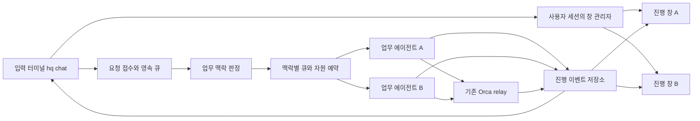

# HQ 작업 맥락별 진행 창 설계

작성일: 2026-09-08. 상태: Orca 오케스트레이션을 통한 구현·검토 수정·설치 완료. 자동 테스트 1,066개 통과. 실제 검증 범위와 UI 접근 제한은 검증 보고서에 기록.

## 1. 목적과 합의

터미널에서 HQ에 지시한 직후부터 접수·대기·조사·도구 실행·작업자 상태·결과를 확인할 수 있게 한다. 입력 창은 유지하고, 업무 맥락이 다른 지시는 전담 에이전트와 새 진행 창에 배정하여 실제로 병렬 처리한다. 같은 업무의 후속 지시는 기존 에이전트의 맥락과 진행 창으로 돌아간다.

사용자가 합의한 기준은 다음과 같다.

- 같은 프로젝트라도 별개 기능이나 독립 목적이면 새 작업 맥락과 새 창을 만든다.
- 앞선 결과를 수정·검증·조회하는 지시는 해당 맥락과 창을 재사용한다.
- “별도 작업으로”, “아까 작업에 이어서” 같은 명시적 지시를 우선한다.
- 창이 나뉘어도 필요한 이전 결과를 참고할 수 있다.
- 사용자의 후속 결정: 기존 HQ의 전역 직렬 실행을 유지하지 않는다. HQ는 접수·맥락 판정·배정을 맡고 독립 업무는 여러 에이전트가 동시에 실행한다.

별도 창의 기본안은 macOS Terminal 앱의 새 창이다. 앞선 선택 질문에 창 종류를 명시한 답은 없으므로 이는 설계 기본값이며, Orca 내부 탭은 후속 어댑터로 교체 가능하게 둔다. 이후 사용자가 Orca 오케스트레이션을 통한 에이전트·모델 선별과 작업 진행을 지시하여 구현·설치·실기 검증을 진행한다. 역할과 파일 소유권은 `../implementation/2026-09-08-progress-team-contract.md`에 기록한다.

## 2. 설계 시작 시 확인한 코드 상태

아래 표는 구현 전 조사 기록이다. 이후 설치본 대화 기능을 저장소에 통합했으며, 기존 제어 클라이언트의 timeout은 설치본 기준 240초를 보존했다. 실제 구현·검증 상태는 `../implementation/2026-09-08-progress-verification.md`와 수용 기준 대응표 `../implementation/2026-09-08-progress-acceptance-map.md`에서 확인한다.

| 위치 | 현재 동작 | 설계에 미치는 영향 |
| --- | --- | --- |
| `packages/installer/src/chat.ts:24` | `control.send()` 완료까지 다음 입력 처리를 기다림 | 접수와 결과 수신을 분리해야 다음 지시도 입력할 수 있음 |
| `packages/installer/src/control.ts:70` | HTTP 본문 전체를 모아 최종 JSON 한 번만 반환 | 중간 이벤트를 받는 별도 계약 필요 |
| `packages/installer/src/control.ts:6` | 전체 요청 제한 60초 | 긴 작업의 수명과 전송 연결의 수명을 분리해야 함 |
| `apps/gateway/src/managed-control.ts` | `POST /commands`가 실행 완료를 기다림 | 기존 경로는 호환용으로 유지하고 비동기 접수 경로 추가 |
| 설치본 `apps/gateway/src/codex-session.ts:104` | Codex commentary를 `onProgress`로 전달 | 실제 진행 설명을 관찰할 수 있음 |
| 설치본 `apps/gateway/src/agent-conversation.ts:72` | `onProgress` 전달, `onTool`에서 도구 실행 | 진행 설명과 도구 시작·종료 이벤트의 삽입 지점 |
| 설치본 `apps/gateway/src/managed-service.ts:78` | Slack·Telegram 입력에 진행 콜백 연결 | 터미널 전달 경로를 추가하되 기존 채널 동작 유지 |
| `apps/gateway/src/orca-relay.ts` | native 작업의 `onUpdate`, 작업 ID·Dispatch 추적 | HQ 답변 이후에도 작업자 상태를 이어서 관찰 가능 |
| 설치본 `managed-service.ts`, `agent-conversation.ts` | 전역 직렬 실행 | 전역 실행 대기를 제거하고 맥락별 실행 큐·동시성 제어로 교체 |

설치본 루트는 `/Users/j.jaeyo/Applications/orca-hq`, 저장소 루트는 `/Users/j.jaeyo/Project/ETC/orca-hq`이다. 저장소에는 `agent-conversation.ts`, `agent-tools.ts`, `codex-session.ts`와 관련 테스트가 아직 없다. 설치본 전체 덮어쓰기나 구형 대화기로의 회귀 없이, 필요한 소스·타입·테스트 차이를 먼저 통합한다.

## 3. 선택한 방식과 대안

| 방식 | 장점 | 한계 | 결정 |
| --- | --- | --- | --- |
| 입력 창에 진행 내용만 출력 | 구현 범위 작음 | 여러 업무를 구분하기 어려움 | 별도 창 실패 시 대체 표시 |
| 세션당 진행 창 하나 | 창 관리 단순 | 다른 업무가 같은 창에 섞임 | 채택하지 않음 |
| 작업 맥락당 진행 창 하나 | 업무별 추적·복귀·재연결 가능 | 맥락 판정과 이벤트 저장 필요 | 기본 설계 |

새 독립 업무에는 전담 실행 에이전트를 배정한다. 진행 창 자체는 읽기 전용 관찰자이며 창을 다시 열었다고 에이전트를 하나 더 만들지는 않는다. HQ 전용 coordinator 터미널, 맥락별 에이전트 세션, 실제 코딩 작업자 터미널, 진행 표시 창은 서로 다른 역할이다.

## 4. 사용 흐름

1. 사용자가 `hq chat`에서 지시한다.
2. CLI는 즉시 접수 중임을 표시한다. 서버가 요청을 영속 저장하면 요청 ID와 대기 상태를 반환하고 입력 프롬프트를 다시 연다.
3. 맥락 판정이 끝나기 전에는 입력 창에 `업무 맥락 확인 중`을 표시한다. HQ는 앞선 업무의 완료를 기다리지 않고 새 지시를 분류·배정한다. 이 단계에서 임시 업무 창을 계속 만들지 않는다.
4. 서버가 맥락을 확정하면 `새 작업: GH · 법령 이력관리` 또는 `이어서 진행: GH · 법령 이력관리` 이벤트를 보낸다.
5. 입력 CLI가 그 맥락의 진행 창을 찾거나 새로 열고, 서버는 실행 슬롯과 자원 충돌을 확인해 전담 에이전트를 시작하거나 재개한다. 한도 또는 충돌로 대기하면 원인을 해당 창에 표시한다. 창을 열지 못해도 작업과 이벤트 기록은 계속된다.
6. 진행 창에서 실제 이벤트와 경과 시간을 표시한다. 입력 창에는 접수·맥락 연결·질문·최종 요약 등 짧은 알림만 표시한다.
7. HQ가 작업을 전달한 뒤 답변을 끝내더라도 native 작업이 실행 중이면 창은 `작업자 실행 중`을 유지한다.
8. 작업 종료 후에도 창과 결과를 남긴다. 후속 요청은 같은 맥락에서 새로운 요청 구간으로 이어진다.

예시:

```text
HQ · GH · 법령 이력관리 [ctx_ab12]

11:00:01  요청 접수 · 구현 현황 검토
11:00:02  새 작업으로 시작
11:00:03  HQ 진행 설명 · 관련 작업 공간을 확인하겠습니다
11:00:04  도구 시작 · GH 작업 공간 조회
11:00:05  도구 완료 · 작업 공간 1개 확인
11:00:07  Orca 작업 접수 · task_123
11:00:09  작업자 상태 · 실행 중

현재: 작업자 실행 중 · 경과 00:42 · 마지막 상태 확인 11:00:49
```

위 문구는 표시 예시다. 코드 탐색·테스트 실행 등을 실제 관찰하지 않았다면 해당 단계를 생성하지 않는다. 진행률 백분율이나 추정 완료 시간은 제공하지 않는다. 경과 시간은 현재 단계의 진행 성과를 뜻하지 않는다.

## 5. 맥락 판정 규칙

맥락은 `프로젝트 + 기능/업무 + 목적 + 연관 작업`으로 판단한다. 프로젝트명이나 마지막 창 하나만으로 결정하지 않는다.

| 입력 | 처리 |
| --- | --- |
| GH 법령 이력관리 구현 현황 검토 | 새 맥락 A |
| 방금 찾은 미구현 부분 수정 | A 계속 |
| 하만 로그인 오류 확인 | 새 맥락 B |
| GH 자체안전점검 검토 | 새 맥락 C |
| 아까 법령 이력관리 진행 상황 | A 조회·창 재사용 |
| 법령 이력관리를 별도 작업으로 다시 비교 | A를 참고하는 새 맥락 D |
| 같은 법령 기능의 화면·API·배치까지 검토 | 같은 목적이면 A에 여러 저장소 연결 |

판정 우선순위:

1. `/context <ID>` 또는 명시적 작업 ID와 “별도 작업으로” 같은 사용자 지시.
2. 현재 대기 중인 구체적인 확인 질문에 대한 답변.
3. 기능·목적·참조 작업·대화 흐름을 이용한 모델의 구조화된 제안.
4. 애매하면 입력 창에서 구체적인 대상 한 가지를 확인한다. 답변 전에는 변경 작업을 실행하지 않는다.

라우터에는 최근 맥락 최대 20개의 ID·제목·프로젝트·요약·연관 작업·최근 질문을 제공한다. 명시적으로 오래된 업무를 지목하면 영속 맥락에서 검색한다. 후보에 없는 context ID는 거절한다. 모델의 “확신 점수”만으로 변경 대상을 정하지 않는다.

순수 인사·도움말·전체 작업 목록에는 새 업무 창을 만들지 않는다. 한 문장으로 여러 독립 업무를 요청하면 요청 1개가 여러 맥락에 연결될 수 있다. 각 하위 지시는 원문의 제약과 해당 업무의 내용을 보존하며 중복 실행 ID를 별도로 고정한다.

기본 탐색 범위는 같은 사용자·같은 대화 세션이다. `/new`는 새 대화 세션을 만들며 기존 작업과 창을 종료하지 않는다. 다른 세션의 맥락은 명시적인 `/context <ID>` 또는 정확한 작업 ID로 연결할 때만 접근한다. 여러 맥락에서 확인을 기다리는데 “네”만 입력했다면 어느 질문의 답인지 먼저 확인한다.

## 6. 대화와 실행 맥락의 분리

`sessionId`는 입력 대화, `contextId`는 업무 묶음, `requestId`는 한 번의 사용자 지시다. Orca `taskId`와 `dispatchId`는 실제 실행을 식별한다. 창 ID는 이들 중 어느 것의 영속 식별자도 아니다.

업무 실행 대화는 맥락별 Codex thread를 사용한다. 라우터 대화와 작업 실행 대화도 분리한다. 새 맥락은 원문 요청·선택 대상·관련 이전 결과의 제한된 요약을 받으며, 관계없는 대화 전체를 복제하지 않는다. 참조 요약에는 출처 context/request/job ID와 시점을 붙인다.

라우터는 맥락 선택을 제안하는 역할만 한다. 등록·파일 수정·작업자 생성 도구를 주지 않는다. 서버가 ID와 소유권을 검증하고 맥락을 확정한 뒤 기존 실행 도구를 호출한다.

### 병렬 에이전트 실행

HQ 라우터는 접수·맥락 선택·진행 조회·필요한 확인 질문을 맡고 긴 코드 검토나 개발을 직접 기다리지 않는다. 실제 업무는 맥락별 전담 에이전트가 맡는다. 전담 에이전트에는 독립적인 Codex thread, 요청 큐, 실행 상태, 이벤트 출처를 부여한다. 프로세스가 종료되어도 같은 thread와 영속 맥락으로 이어갈 수 있으므로 “같은 에이전트”를 같은 OS PID로 정의하지 않는다.

전역 `serial`을 단순 삭제하지 않는다. 접수 저장과 짧은 맥락 확정은 원자적으로 처리하고, 실행 대기는 `contextId`별 큐로 바꾼다. A 에이전트가 느리거나 실패해도 B의 배정·실행·결과 전달이 막히지 않는다. 같은 맥락의 Codex thread에는 동시에 두 turn을 넣지 않는다. 읽기 전용 진행 조회와 중지 요청은 긴 모델 turn 뒤에서 기다리지 않는 제어 경로로 처리한다.

활성 업무에 들어온 후속 지시는 같은 큐에 기록한다. 실행 중인 native worker에 즉시 전달 가능한 보완 지시라면 기존 Dispatch의 guidance 경로로 한 번만 보낸다. 목표·수정 범위를 바꾸는 후속 지시는 현재 작업 상태와 충돌을 확인한 뒤 처리한다. 새 후속 입력 때문에 같은 맥락에 두 번째 편집자를 자동 생성하지 않는다.

사용자 결정에 따라 기본 동시 업무 한도는 5개로 확정한다. HQ 라우터는 이 5개 업무 슬롯에 포함하지 않으며 한도는 설정으로 조정할 수 있다. HQ 라우터는 별도 처리 경로를 확보해 슬롯이 찼어도 접수·조회·중지할 수 있다. 맥락별 native 코딩 worker는 동시에 최대 1개로 제한한다. 업무 에이전트가 worker에 위임한 뒤에는 상태 polling마다 모델을 호출하지 않고 이벤트로 관찰한다. API 호출과 메모리 사용량을 측정하되 사용자가 지정한 기본값 5개를 자동으로 낮추지 않는다. 모델의 내장 무제한 하위 에이전트 기능을 켜는 대신 HQ 서비스가 명시적인 실행 슬롯과 수명주기를 관리한다.

전담 에이전트는 현재 설치본의 제한된 도구를 사용하는 업무 세션이며, 실제 파일 작업이 필요하면 기존 Orca Task/Dispatch/worker를 통해 실행한다. 진행 창에는 두 단계의 에이전트 역할과 실제 작업 상태를 구분해 표시한다. 맥락 에이전트의 실패가 이미 시작한 native worker를 취소하지 않는다.

### 수정 충돌과 실행 소유권

서로 다른 프로젝트·작업 공간의 독립 업무는 병렬 실행한다. 같은 checkout에서 겹칠 수 있는 수정은 한 작업만 소유하도록 영속 예약한다. 예약 키는 정규화한 실제 checkout 경로이며 중첩 경로도 충돌로 간주한다. 첫 버전의 수정 예약은 파일 목록 추측 대신 checkout 단위로 보수적으로 적용한다.

모델이 실제 작업에 들어가기 전에 `read` 또는 `write` 접근과 대상 checkout 집합을 선언하고 서버가 검증한다. 여러 checkout 예약은 한 트랜잭션에서 전체 확보하거나 전부 대기하여 교착을 막는다. read/read는 병렬 허용, read/write와 write/write는 같은 checkout에서 대기한다. 이는 HQ가 관리하는 실행끼리의 일관성을 보장하며 외부 사용자의 파일 변경까지 잠그는 기능은 아니다. 검토 결과에는 작업 시점을 남긴다.

서로 충돌하는 지시는 창을 각각 열되 `다른 작업의 수정 완료 대기`로 표시한다. 기존 정책을 우회하여 worktree를 자동 생성하지 않는다. 별도 checkout 생성이 허용된 요청이라면 독립 배치를 선택할 수 있으며, 이때 미커밋 변경을 포함하는지와 기준 브랜치를 명시한다. 공용 DB·배포·외부 시스템 변경은 checkout이 달라도 해당 자원에 별도 배타 예약을 요구한다.

작업 lease의 heartbeat 손실은 편집자가 종료됐다는 증거가 아니다. 오래된 예약은 즉시 해제하지 않고 Orca Dispatch·worker 상태를 조회한다. 종료를 확인하지 못하면 `recovery_required`와 예약을 유지한다. 재연결·재시도에는 generation을 부여하고 이전 generation의 실행기가 추가 변경 도구를 호출하지 못하도록 서버가 검증한다. 이미 시작한 외부 프로세스는 generation만으로 정지하지 않으므로 native 실행 소유권 확인도 필요하다.

## 7. 구성과 경계



서버는 이벤트·맥락·작업 연결을 관리한다. 데스크톱 창은 대화형 CLI가 연다. launchd로 실행되는 gateway에서 GUI 창을 직접 생성하지 않는다. Slack·Telegram에서 들어온 요청에는 자동 창 생성 이벤트를 전달하지 않는다.

기존 coordinator 복구 기능은 그대로 사용한다. 진행 창의 재연결은 context ID와 이벤트 커서로 수행하며, 만료 가능한 Orca 터미널 핸들에 의존하지 않는다.

## 8. 영속 데이터 계약

별도 SQLite 파일 `~/.config/orca-hq/progress.sqlite`에 아래 테이블을 둔다. 디렉터리 0700, 파일 0600을 적용한다. 세션의 소유자는 서버가 정하며 클라이언트의 임의 소유자 값을 신뢰하지 않는다.

| 테이블 | 핵심 필드·제약 |
| --- | --- |
| `progress_requests` | `request_id` PK, `owner_key`, `session_id`, 원문, `state`, `created_at`, `claimed_at`, 최종 응답; 같은 ID에 다른 본문은 충돌 |
| `work_contexts` | `context_id` PK, `owner_key`, `origin_session_id`, 제목, 목적, 요약, `thread_id`, `revision`, 생성·갱신 시각 |
| `context_agents` | `context_id` PK, `agent_id`, 현재 request, 실행 상태, generation, heartbeat, 마지막 관찰; 같은 맥락의 활성 model turn은 하나 |
| `execution_reservations` | 예약 ID, `context_id`, request, generation, 정규화 자원, read/write 모드, 확보·갱신 시각, native dispatch; 모든 자원 예약을 원자적으로 확보 |
| `request_contexts` | `(request_id, part_id)` PK, `context_id`, `relation`, `source_context_id`, 원문의 하위 지시; 한 지시가 여러 맥락에 연결 가능 |
| `context_projects` | `(context_id, project_id)` PK; 한 업무가 FE·BE·배치 여러 저장소를 포함 가능 |
| `context_jobs` | `(context_id, job_id)` PK, 원인 `request_id`, `dispatch_id`; 창 종료 후에도 관찰 유지 |
| `progress_events` | `seq` 증가 PK, `event_key` UNIQUE, `request_id`, nullable `context_id`, 종류, 출처, 시각, 안전한 표시 payload |
| `progress_viewers` | `context_id` PK, `viewer_instance_id`, lease token 해시, heartbeat 시각, 창 생성 시도 상태 |

접수 행과 `request.accepted` 이벤트는 같은 트랜잭션으로 저장한다. 다른 DB에 걸친 원자성을 가정하지 않는다. durable 큐에서 기존 실행기로 인계할 때 안정적인 요청 ID를 사용하고, 재시작 시 기존 receipt를 조회하여 조정한다. 이미 실행을 시작했는데 결과가 없으면 `recovery_required`로 표시하며 자동 재실행하지 않는다. 아직 실행을 시작하지 않은 queued 요청만 재개할 수 있다.

맥락 판정과 요청 연결은 부작용 실행 전에 고정한다. 사용자가 분류를 정정하더라도 이미 실행된 작업을 다시 실행하지 않는다. 기존 agent 도구의 중복 방지 키는 대화 키를 포함하므로, 실행이 시작된 요청의 실행 맥락은 불변으로 두고 표시상 참조 연결만 추가한다. 정정 후 새 지시는 새 request ID로 처리한다.

관찰 이벤트의 중복 제거 키는 producer 종류와 원본 ID·revision으로 만든다. 모델 commentary 두 개의 내용이 같다는 이유만으로 합치지 않는다. worker 상태는 같은 상태·갱신 시각의 반복 polling 결과를 중복 적재하지 않는다.

## 9. 접수·조회 프로토콜

기존 소유자 전용 Unix domain socket을 재사용한다. 기존 `POST /commands`는 구형 CLI 및 단발 호환 경로로 유지한다. 새 `hq chat`은 아래 비동기 경로를 사용한다.

```text
POST /v1/progress/requests
  {requestId, sessionId, text, contextHint?: {mode: "new"|"continue", contextId?: string}}
  202 {requestId, state: "queued"}

GET /v1/progress/requests/:requestId
  접수·분류·실행 상태, 연결 맥락, 최종 응답

GET /v1/progress/events?sessionId=...&after=123&follow=1
GET /v1/progress/events?contextId=...&after=123&follow=1
  application/x-ndjson, 순서가 있는 이벤트 및 연결 heartbeat

GET /v1/progress/contexts
GET /v1/progress/contexts/:contextId
  소유자 범위 맥락 목록 / 제목·상태·요약·연관 작업 snapshot

POST /v1/progress/contexts/:contextId/viewer-lease
POST /v1/progress/contexts/:contextId/viewer-heartbeat
DELETE /v1/progress/contexts/:contextId/viewer-lease
  읽기 전용 표시 프로세스의 단일 실행 예약·갱신·반납
```

이벤트는 `{seq, eventKey, requestId, contextId, kind, source, occurredAt, payload}` 형태다. 분류 전 contextId는 null이다. `source`는 `hq`, `tool`, `orca`, `system` 중 하나다. 공개용 진행 설명만 사용하며 내부 추론을 노출하거나 만들어 내지 않는다.

종류: `request.accepted`, `request.queued`, `context.assigned`, `agent.started`, `agent.resumed`, `agent.waiting`, `clarification.required`, `hq.progress`, `tool.started`, `tool.completed`, `tool.failed`, `job.linked`, `job.state`, `request.completed`, `request.failed`, `recovery.required`.

업무 에이전트가 만드는 이벤트에는 `agentId`와 실행 generation을 추가한다. 슬롯 부족, 수정 자원 충돌, 같은 맥락의 앞선 지시 대기는 `agent.waiting`에서 각각 구분한다. 다른 맥락의 도구 이벤트·답변·질문이 현재 창으로 섞이지 않도록 producer가 서버에서 확정한 context/request 연결을 사용한다.

연결은 10초마다 heartbeat를 보내고, 클라이언트는 마지막 수신 후 30초간 응답이 없으면 연결 끊김으로 표시한다. 재연결 간격은 1·2·5·10초, 이후 10초다. 마지막 표시 seq 뒤부터 읽어 중복 표시를 막는다. 연결 재시도는 요청 재실행과 분리한다. 느린 관찰자는 연결을 끊고 영속 커서로 재연결하게 하며 실행기를 막지 않는다. 한 연결의 전송 버퍼 상한은 1MiB, 개별 이벤트는 8KiB다. 긴 결과는 snapshot 조회로 읽는다.

클라이언트는 POST 전에 request ID를 고정한다. 응답을 잃으면 같은 ID의 상태를 먼저 조회한다. 접수 재전송이 필요해도 동일 ID·동일 본문만 허용하며 새 ID를 만들어 자동 재실행하지 않는다.

## 10. 창 동작

표시 프로세스는 `hq watch --context <ID>`로 실행한다. CLI의 창 관리자와 watch 프로세스만 viewer lease를 사용한다. lease는 5초마다 갱신하고 20초 후 만료된다. 창 생성 직전 원자적으로 lease를 예약해 같은 맥락에서 창이 중복 생성되는 것을 막는다.

| 상황 | 동작 |
| --- | --- |
| 새로운 업무 맥락 | Terminal 새 창 생성, 제목 `HQ · 프로젝트 · 업무 [짧은 ID]` |
| 같은 맥락, 살아 있는 viewer | 기존 창에 새 요청 구간 추가; 포커스 강탈하지 않음 |
| 사용자가 진행 창을 닫음 | viewer만 종료; 작업·이벤트 저장 계속 |
| 닫힌 맥락에 새 후속 지시 | lease 종료 확인 후 새 viewer 창으로 같은 맥락 복원 |
| 완료된 맥락에 후속 지시 | 기존 창을 재사용하고 새 요청 구간 시작 |
| gateway 재시작 | viewer에 재연결 표시, snapshot과 cursor로 복원 |
| CLI 종료 | 이미 접수된 요청·작업·viewer는 계속 유지 |
| 창 생성 오류·GUI 없는 SSH·파이프 입력 | 자동 창 생성 생략, 입력 창에 상태와 `hq watch` 명령 제공 |
| 창 생성 응답 유실 | 같은 lease의 viewer 등록을 확인; 같은 입력 처리에서 창 생성을 반복하지 않음 |

watch 프로세스의 종료·Ctrl+C는 작업 취소가 아니다. 작업 중지는 기존의 명시적인 HQ 중지 지시로만 수행한다. 완료된 창도 자동 종료하지 않는다. 사용자가 닫은 창을 background 상태 업데이트 때문에 다시 열지 않는다. 새로운 후속 입력이나 명시적인 창 열기 명령만 다시 열 수 있다.

macOS adapter는 `osascript` 실행 파일과 고정 스크립트를 사용한다. 고정된 설치 경로의 `hq watch` 명령에 검증된 opaque context ID와 viewer token만 전달한다. 요청 본문·모델 생성 제목·파일 내용은 shell/AppleScript 명령 문자열에 넣지 않는다. 제목과 이벤트는 watch 프로세스가 검증된 데이터로 렌더링한다. 출력의 ESC·OSC 등 제어 문자를 제거한다.

Terminal 설정에 따라 새 탭이 되는 경우를 포함해 실제 새 창 생성 동작은 macOS 수동 검증 항목이다. 시스템의 자동화 권한 거절이 있으면 오류와 수동 watch 명령을 표시하고 실행 요청은 유지한다. 창 관리용 GUI 의존성을 gateway에 넣지 않는다.

## 11. 상태와 결과

요청 상태는 `queued → classifying → awaiting_input 또는 executing → completed/failed/recovery_required`다. `awaiting_input`에서 사용자의 답을 연결하면 해당 요청을 이어서 처리한다. 답변은 별도 request ID로 기록하되 원래 질문 ID에 연결한다.

진행 창의 전체 상태는 요청 상태와 native 작업 상태를 함께 계산한다. HQ가 “작업 전달 완료”라고 응답한 것은 worker 완료가 아니다. 한 맥락의 실행 중 요청과 연관 작업이 모두 끝나야 완료로 표시한다. native 상태를 조회하지 못하면 마지막 확인 시각과 `연결 확인 필요`를 표시하며 임의로 실패·완료로 바꾸지 않는다.

worker-read 전문을 기본으로 흘리지 않는다. 1차는 HQ 진행 설명, 실제 도구 실행 요약, native 작업 상태와 최종 결과를 보여준다. worker의 파일 단위 작업·테스트 세부 로그는 해당 데이터가 실제 제공될 때만 표시하며, 원시 터미널 미러링은 후속 범위다.

같은 맥락의 복수 작업은 작업 ID별로 표시한다. 나중 요청 실패가 앞선 성공을 덮어쓰지 않는다. 재시도는 새 Dispatch를 별도 시도로 보여주며 기존 실패 기록을 남긴다.

## 12. 저장·정보 노출

도구 인자 전체와 원시 도구 응답을 출력하지 않는다. 도구별 허용 필드로 목적·대상·소요 시간·성공 여부를 요약하고 기존 `redactRelayText`를 적용한 뒤 저장한다. 모델 commentary도 같은 처리를 거친다. 공개 예시에서 실제 자격증명이나 터미널 전문을 사용하지 않는다.

완료된 요청의 상세 이벤트는 30일 보관한다. 실행 중·응답 대기·복구 확인 필요 요청의 기록은 지우지 않는다. 맥락 제목·요약·최종 결과·작업 ID는 보존한다. 삭제된 커서로 접근하면 snapshot과 `history.compacted` 표시를 반환하고 가장 오래된 남은 이벤트부터 이어 읽는다. 이벤트 보관 정책은 실행 멱등성 receipt를 삭제하지 않는다.

## 13. 수용 기준

1. 정상 로컬 환경에서 입력 후 100ms 이내 CLI 접수 표시, durable 접수 응답은 1초 이내를 목표로 측정한다. 모델 판정이 늦어도 입력 창이 무응답처럼 보이지 않는다.
2. 모델이나 도구가 조용해도 경과 시간과 연결 상태는 갱신된다. heartbeat를 작업 진척으로 표시하지 않는다.
3. 같은 업무의 후속 요청·완료 후 재개는 동일 context ID와 살아 있는 viewer 하나를 재사용한다.
4. 다른 프로젝트 또는 같은 프로젝트의 별개 기능은 새 맥락과 새 창을 만든다. multi-repo 단일 업무는 하나의 맥락을 유지할 수 있다.
5. 잘못된 후보 ID·애매한 후속 지시는 변경 작업에 전달되지 않는다. 분류 정정·연결 복구가 작업을 중복 실행하지 않는다.
6. CLI·viewer·gateway·Orca 각각의 종료/재시작에서 영속 ID와 실제 상태를 조정한다. viewer 종료는 worker를 종료하지 않는다.
7. HQ 답변 완료 뒤 worker가 실행 중이면 창도 실행 중을 표시한다. 여러 작업과 재시도의 결과가 섞이지 않는다.
8. 창 생성 실패·동시 열기·응답 유실·느린 viewer·60초 초과 작업을 검증한다.
9. Slack·Telegram 요청만으로 데스크톱 창이 열리지 않는다. 기존 채널의 실행·응답·중복 방지 테스트가 유지된다.
10. 원문에 따옴표·개행·역따옴표·명령 치환 문자열·ANSI 제어 문자가 있어도 창 열기가 shell 실행이나 터미널 제어로 이어지지 않는다.
11. 업무 A의 모델 응답을 의도적으로 멈춰도 독립 업무 B가 에이전트를 시작하고 완료한다. 두 에이전트의 실제 실행 구간이 겹치는지 검증하며 창 두 개만 열렸다는 사실로 병렬 성공을 판정하지 않는다.
12. 같은 맥락의 후속 turn은 겹치지 않고, A의 실패·중지·재시도가 B의 thread·worker·결과에 영향을 주지 않는다. 슬롯 한도에 도달해도 HQ의 새 지시 접수·상태 조회·중지 경로는 응답한다.
13. 같은 checkout의 두 편집자가 동시에 시작하지 않으며, 다중 자원 예약·외부 변경 예약·재시작 후 오래된 lease에서 중복 편집자가 만들어지지 않는다.

## 14. 구현 순서와 검증

구체적인 단계는 `../plans/2026-09-08-hq-context-progress-windows.md`에 기록한다. 순서는 설치본 차이 통합 → 영속 맥락·이벤트·자원 예약 → 비동기 접수 → 맥락 라우팅·병렬 에이전트 실행 → 진행 이벤트 연결 → CLI watch·창 관리 → 통합·실기 검증이다.

서로 독립적인 지시를 맥락별 에이전트가 병렬 실행하고 각 창으로 관찰하는 것이 범위다. 동시 실행 한도·수정 소유권·영속 작업 식별자는 HQ가 관리하며 실제 코딩 lifecycle은 기존 Orca 계층을 사용한다. 사용자가 이미 실행 중인 다른 worker를 진행 창으로 이동하거나 무제한으로 추가 에이전트를 생성하지 않는다.

동시성 수용 기준: 독립 업무 5개가 동시에 실행되고 6번째 업무는 FIFO로 대기한다. 슬롯 하나가 반환되면 6번째 업무가 시작하며, 포화 상태에서도 HQ 접수·조회·중지는 계속 응답한다.
