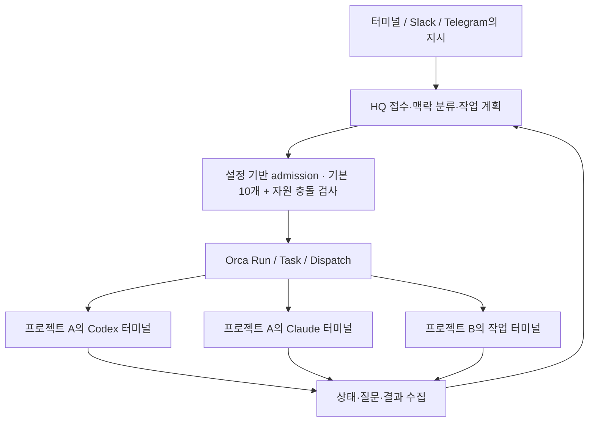

# HQ의 실제 Orca 에이전트 실행 구조

작성일: 2026-09-08. 상태: 사용자 요청에 따른 재설계안. 이 문서는 구현 완료를 뜻하지 않는다.

## 목표

HQ가 지시를 분류하고 프로젝트·에이전트·모델을 선정하여 Orca 오케스트레이션으로 직접 배정한다. 실제 작업은 해당 Orca 프로젝트의 에이전트 터미널에서 수행한다. HQ가 관리하는 동시 작업 에이전트의 초기 운영 기본값은 **10개**이며 설정으로 변경할 수 있다.

## 현재 구현과 차이

- `apps/gateway/src/managed-runtime.ts`는 context 실행을 `conversation.execute()`에 연결한다. 그 대화 모델이 도구 호출 여부를 결정하므로 모든 실무 지시가 native worker를 만들지는 않는다.
- `apps/gateway/src/context-executor.ts`는 context 기본 5개를 세며, context별 native worker 하나를 제한한다. 실제 worker 총량과 다른 단위다.
- `apps/gateway/src/progress-runtime.ts`의 `agent.started`는 native launch 전 context turn 시작 때 발생한다.
- `packages/installer/src/chat.ts`와 `progress-window.ts`는 macOS Terminal에 관찰용 `hq watch` 창을 연다.
- `apps/gateway/src/orca-relay.ts`에는 Run/Task/worker-start/관찰/정리/복구가 이미 있으나 fresh agent는 Codex로 고정되어 있다.

## 검토한 대안

| 대안 | 장점 | 문제 | 결정 |
|---|---|---|---|
| 현재 대화 모델에 Orca 호출을 강하게 권고 | 변경 작음 | 실제 native 실행을 보장하지 못함 | 제외 |
| 기존 relay를 기반으로 실무 실행을 native 경로로 고정 | 기존 복구·예약·접수 재사용, 요구사항 직접 충족 | admission과 lifecycle 계약 수정 필요 | 채택 |
| 기존 실행 계층 전면 교체 | 구조를 새로 정리 가능 | 검증된 복구와 호환성을 동시에 잃을 위험, 범위 확대 | 제외 |

## 실행 계약

1. 접수 결과를 즉시 저장하고 HQ 입력을 계속 받는다. 접수는 실행 시작이나 완료가 아니다.
2. HQ 모델은 맥락 분류·작업 분해·결과 요약을 담당한다. 프로젝트 코드 읽기/분석/편집은 작업 에이전트에게 배정한다. 라우터에는 프로젝트 실행 도구를 제공하지 않는다.
3. 개발·분석·검토 지시는 반드시 native Task/Dispatch를 만든다. 단순 인사·도움말·작업 목록·정지/상태 조회는 검증된 HQ 관리 경로를 사용한다. 조회와 실무 분석이 혼합되면 실무 부분은 worker로 보낸다.
4. 프로젝트 이름은 등록 목록으로 해석하고 정확한 repo/worktree 식별자를 고정한다. 불명확한 프로젝트는 입력 대기로 두며 현재 활성 탭으로 추측하지 않는다.
5. 기존 checkout에 새 에이전트 터미널을 만드는 것이 기본이다. 새 업무라는 이유만으로 Git worktree를 추가하지 않는다. 실제 쓰기 충돌이 있으면 대기하며, 별도 checkout이 필요할 때만 기존 배치 정책에 따라 이유를 설명하고 생성한다.
6. gateway의 기존 durable HQ Run을 재사용한다. context에는 여러 Task가 연결될 수 있고 각 실행 시도는 별도 Dispatch다. Run은 Orca의 namespace/inbox이며 HQ의 스케줄러를 대신하지 않는다.
7. 모든 시작은 하나의 admission 계층을 통과한다. worker는 추가 에이전트를 직접 실행하지 않고 HQ에 분해 요청을 보낸다. 일반 사용자에게 생성한 터미널 수를 완료 수처럼 표시하지 않는다.

## 동시 실행 운영 설정

- 범위: 한 HQ 설치가 관리하는 모든 프로젝트·입력 채널의 작업 worker 총량. 사용자가 별도로 실행한 Orca 에이전트와 HQ 조정자는 제외한다.
- `maxActiveWorkers`의 생략 시 기본값은 10이다. 양의 안전한 정수로 증감하거나 명시적 문자열 `"unlimited"`로 개수 제한을 해제할 수 있다. 0·음수·소수·null·비정상 숫자는 거부한다. 제한 해제도 자원 충돌 검사, 실행 소유권, 중복 방지, 모델 사용량 제한에 따른 대기를 해제하지 않는다. 설정은 gateway 시작 시 적용하며, 한도를 낮춰 재시작해도 기존 작업을 종료하지 않고 점유 수가 새 한도 아래로 내려올 때까지 신규 배정을 대기시킨다.
- 계산: admission을 얻은 launch 준비/실행/질문 대기/정지 확인 대기/결과 불명 worker가 각각 1개를 사용한다. 완료가 확인된 보관 터미널은 실행 슬롯을 사용하지 않는다.
- 한 업무에서 3개 worker를 쓰면 3개를 차지한다. context 수에는 10개 제한을 걸지 않는다.
- 기본 설정에서는 11번째 worker가 FIFO 대기한다. 유한 설정 N에서는 N+1번째가 대기하며, `"unlimited"`에서는 개수만을 이유로 대기하지 않는다. 의존성이 미충족이거나 자원이 충돌하는 항목은 이유를 표시하고, 실행 가능한 항목 사이에서 접수 순서를 지킨다.
- capacity와 전체 자원 집합을 원자적으로 확보한다. 자원을 기다리면서 실행 슬롯을 독점하거나 일부 자원만 점유하지 않는다.
- 추가 분해를 요청한 worker가 스스로 슬롯을 쥔 채 자식 완료를 기다리게 하지 않는다. 계획 결과를 HQ에 넘겨 Dispatch를 정산한 뒤 HQ가 자식을 배정한다.
- 재시작 시 기존 활성/불명확 시도를 먼저 복원하고 신규 admission을 연다. lease 시간 경과만으로 슬롯이나 쓰기 예약을 해제하지 않는다.
- 완료 결과와 프로세스 정리를 따로 기록한다. 명시적 보관이 확인된 idle 터미널은 제외하지만, 정리 대상의 `release_pending/release_unknown`은 슬롯을 계속 점유한다. 완료 보고만으로 정리 실패를 숨기거나 슬롯을 반환하지 않는다.
- coordinator 소유 세대를 영속화하여 이전 gateway 인스턴스의 신규 배정과 정산을 차단한다. `GATEWAY_EXTERNAL_ADAPTERS` 실행 경로도 같은 admission을 사용하기 전에는 신규 작업 실행을 명시적으로 차단한다.
- 이는 HQ가 배정하는 worker의 한도다. 임의 shell에서 실행된 비관리 프로세스까지 Orca가 전역 차단한다고 주장하지 않는다. 관리 경로를 벗어난 spawn은 지원하지 않고 발견 시 상태 불일치를 표시한다.

## 에이전트와 모델

HQ는 역할별 설정을 읽어 `agent`, `model`, `effort`, 선택 사유를 작업 계획에 기록한다. 사용자 지정이 우선이며 provider ID를 검증된 허용 목록과 설치 환경에 맞춘다.

| 역할 | 초기 제안 | 선정 이유 |
|---|---|---|
| 설계·복잡한 원인 분석 | Codex / gpt-6-astra / high | 복잡한 상태 전이와 설계 판단 |
| 구현·일반 검토 | Codex / gpt-5.6-sol / high | 통상 구현 및 검증 |
| 독립 검토 | Claude / opus / high, 가용할 때 | 다른 provider의 독립 관점 |

실제 시작 결과의 requested/effective 값을 별도로 저장한다. 인증·할당량·모델 지원 실패는 구체적으로 표시한다. 이전 실행이 없거나 확실히 종료됐다고 확인된 경우에만 설정된 대체 모델을 새 시도로 사용한다. 결과 불명 시 다른 모델을 중복 실행하지 않는다. 이 설계 검토는 과거 Claude 한도 실패를 고려해 Codex 두 모델을 사용하며 현재 Claude 가용성을 확인했다고 주장하지 않는다.

## 사용자에게 보이는 상태

- HQ: `접수 → 프로젝트/담당 선정 → 대기 또는 터미널 생성 중 → Orca 실행 중 → 결과 취합 → 완료`.
- `worker-start`의 ready/input_accepted와 정확한 Dispatch/terminal 귀속을 확인한 뒤에만 실행 중으로 표시한다. provider 인증 대기와 모델 응답 생성 여부는 추가 관찰 상태로 구분한다.
- HQ 결과에는 업무명, 프로젝트, agent/model, Orca 터미널 식별자와 작업 ID를 제공한다. terminal이 확인되지 않으면 빈 링크나 시작 문구를 만들지 않는다.
- 새 독립 업무는 새 Orca 터미널을 만든다. 작업 표시를 위해 macOS Terminal의 watch 창을 기본으로 띄우지 않는다.
- `hq watch`는 선택적인 관찰 수단으로 유지한다. 기존 `--progress-window=auto|off`는 watch 표시 제어라는 호환 의미를 유지하고 native worker 생성 여부에는 영향을 주지 않는다. 생략한 기본값은 새 정책에서 watch 자동 열기 없음으로 전환한다.
- Slack/Telegram에서 지시해도 실행 위치는 동일한 Orca 프로젝트다. 터미널 사용 여부가 실행 엔진을 바꾸지 않는다. 이번 계획 작업에서 두 채널로 메시지를 보내지 않는다.

## 후속 지시와 터미널 수명

보관 정책의 제안 기본값은 **완료한 주 담당 터미널 유지**이며, 사용자 선호 응답이 오면 반영한다. 보관과 동시 실행은 별개다.

- active Dispatch의 보충 지시는 기존 worker에 구조화 메시지로 전달한다. 전달 기록과 실제 읽음/처리를 구분한다. scope가 바뀌면 다음 Task로 대기시킨다.
- 완료한 같은 업무는 살아 있고 HQ 소유이며 입력 가능한 정확한 터미널에 **새 Task/Dispatch**를 배정한다. 이전 Dispatch ID를 재사용하지 않는다.
- 보관은 Orca `worker-retain`으로 명시하며, 다시 실행할 때 슬롯과 자원을 새로 확보한다. 완료한 보조 worker는 즉시 후속 작업이 없으면 release한다.
- 사용자가 터미널을 직접 인계받았으면 자동 프롬프트 주입이나 종료를 하지 않는다. 해당 업무는 수동 소유 상태로 표시한다.
- 닫힌 터미널은 context 요약·완료 결과·미완료 지시를 새 terminal에 전달한다. provider session resume은 Orca가 정확한 세션과 지원 명령을 증명할 때만 사용하며, 그 외는 맥락 인계라고 표시한다.
- `hq chat` 또는 watch 종료는 작업 취소가 아니다. **실제 Orca worker 터미널 종료는 프로세스를 멈출 수 있다.** native 상태를 관찰해 stopped 또는 recovery_required로 반영하고 자동 재실행하지 않는다.
- 완료 터미널을 일괄 정리하는 행동은 사용자 명령으로 제공한다. 보관 개수의 자동 무제한 프로세스 비용은 UI에 개수로 드러내되 임의 자동 종료를 추가하지 않는다.

## 실패와 복구

현재 request journal, generation fence, launch receipt 귀속 검증, retry 자원 복구를 보존한다. 응답 유실은 원래 Orca mutation request ID로 조회/정확 재시도한다. 새 request ID로 다시 시작하지 않는다. `worker_done`은 task/dispatch와 현재 세대가 일치할 때만 정산한다. 정산·슬롯 해제·결과 저장·retain/release·Delivery ack는 재진입 가능해야 한다.

프로젝트 탐색·launch·복구는 같은 선택된 Orca 실행 파일과 runtime 연결을 사용한다. worker-start requested/effective와 마지막 실제 관찰 시각을 저장하며 native updatedAt과 혼동하지 않는다. 기존 대시보드와 watch도 같은 native 상태 의미를 사용하도록 맞춘다.

Orca 연결 실패는 연결 대기로 명시한다. 숨은 Codex 세션으로 실무를 대신 수행하지 않는다. HQ coordinator 복구는 기존 Run과 정확한 소유 증거를 사용하며 다른 살아 있는 coordinator를 자동 탈취하지 않는다.

## 전환과 완료 기준

기존 데이터는 삭제하지 않고 additive migration한다. 이미 실행 중인 작업은 기존 실행 방식으로 관찰·정산하고 다시 배정하지 않는다. 기존 context 대화 thread를 native 세션이라고 해석하지 않는다. 신규 실무 요청부터 native 정책을 적용한다.

승인된 구현 후에는 실제 HQ 요청으로 Orca 터미널 생성, 두 업무 동시 실행, 같은 업무 후속 실행, 기본 설정의 10개 실행과 11번째 대기, 상향 설정과 제한 해제 동작, 한 슬롯 반환 후 정확히 하나 시작, gateway 재시작 후 중복 없음까지 검증한다. 동일 checkout 쓰기 충돌과 read/read 병행도 포함한다. native receipt, 터미널 inventory, task/dispatch, provider 출력, 실제 GUI 확인의 증거를 구분한다. 기존 watch 창 테스트만으로 새 구조가 완료됐다고 판정하지 않는다.

본 턴에서는 설계·계획 문서만 작성한다. 운영 코드 변경·설치·서비스 재시작·commit·push는 하지 않는다.

운영 설정 결정 갱신: 사용자는 10개를 고정 최대값이 아닌 초기 운영 설정으로 확정했다. 이전 검토 보고서의 고정 상한 권고보다 이 문서의 설정 계약이 우선한다.
